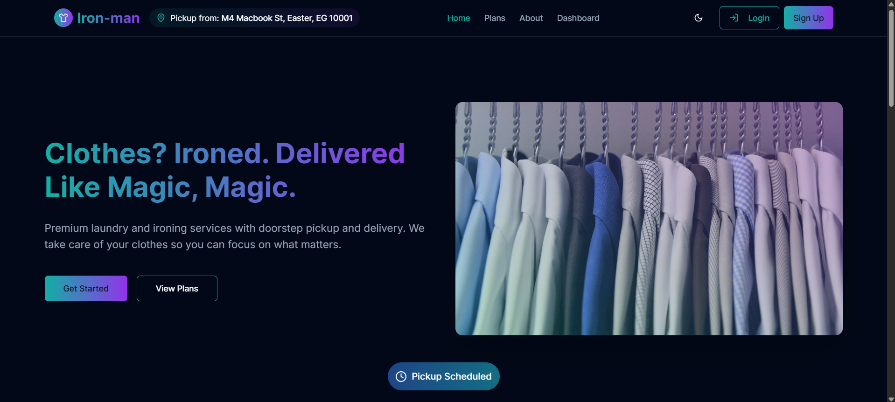
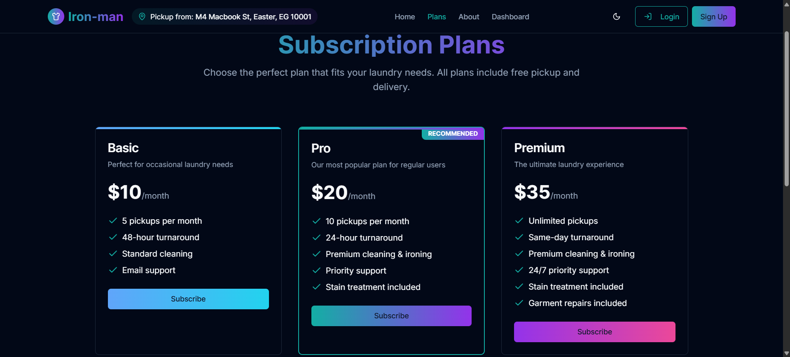
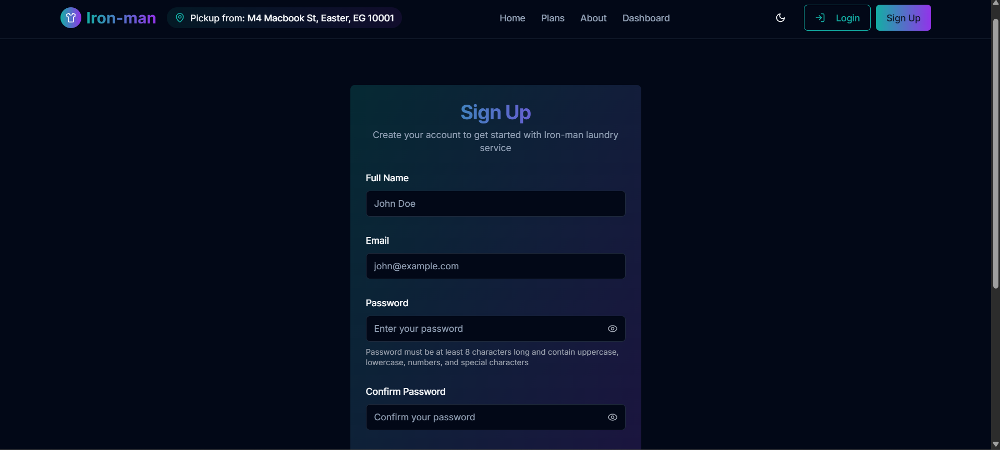
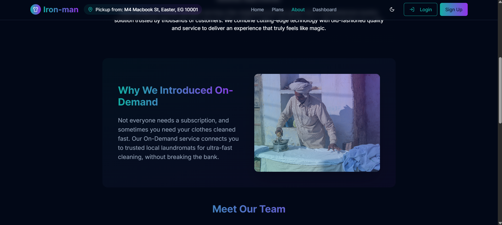
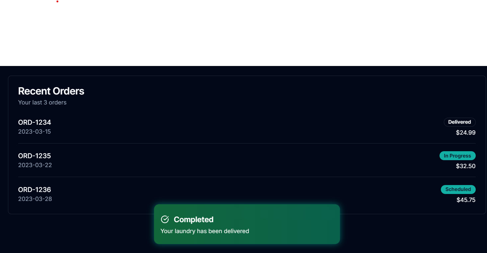
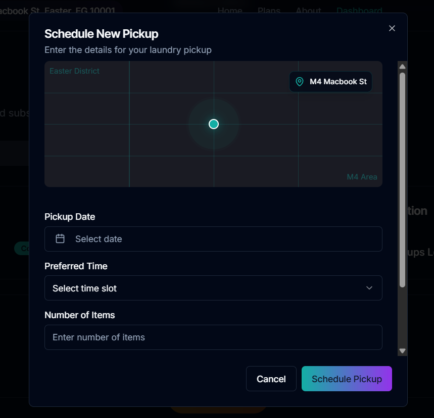
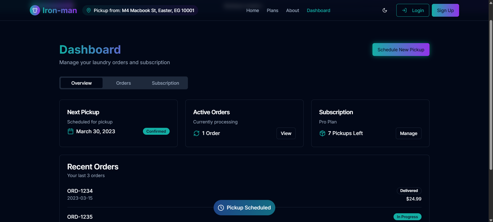

# Iron-man Laundry Subscription Service 🧺

A modern, subscription-based laundry service web application with a stunning UI and seamless user experience. Built with Next.js, TypeScript, and Tailwind CSS.

## 🌟 Features

### Core Features
- **Landing Page**: Engaging hero section with animated CTAs
- **Subscription Plans**: Beautiful pricing tiers with gradient effects
- **User Registration**: Streamlined signup process
- **About Page**: Service information and team showcase
- **Location Tracker**: Real-time pickup location display
- **Dynamic Island**: Interactive laundry status indicator
- **Order Management**: Simple order placement flow

### Technical Features
- ⚡ Next.js 15.1.0 with TypeScript
- 🎨 Tailwind CSS for styling
- 🌓 Light/Dark mode support
- 📱 Fully responsive design
- 🎭 Beautiful gradient effects and animations
- 🔄 Hot reloading for development

## 📸 Screenshots

### Landing Page

*Hero section with animated CTAs and gradient effects*

### Subscription Plans

*Pricing tiers with hover effects and recommended plan highlight*

### Sign-Up Page

*Clean signup form with validation*

### About Page

*Team showcase with gradient cards*

### Dynamic Island

*Interactive laundry status indicator*

### Booking Popup

*Comprehensive Booking-Popup with Map view for the Current Location*

### Dashboard

*Detailed Dashboard page showing Overview, Orders and Subscription details*

### Business & Contact Info

*Clean Contact and Timing cards with hover effects*

## 🚀 Getting Started

### Prerequisites
- Node.js 18.x or later
- npm or pnpm package manager

### Installation

1. Clone the repository:
```bash
git clone https://github.com/RA7AN/ironman.git
cd ironman
```

2. Install dependencies:
```bash
npm install --legacy-peer-deps
# or
pnpm install
```

3. Start the development server:
```bash
npm run dev
# or
pnpm dev
```

4. Open [http://localhost:3000](http://localhost:3000) in your browser.

## 🛠️ Tech Stack

- **Framework**: Next.js 15.1.0
- **Language**: TypeScript
- **Styling**: Tailwind CSS
- **UI Components**: Radix UI
- **Animations**: Tailwind CSS Animate
- **Form Handling**: React Hook Form
- **Validation**: Zod
- **Date Handling**: date-fns
- **Charts**: Recharts
- **Icons**: Lucide React

## 📁 Project Structure

```
iron-man-laundry/
├── app/                 # Next.js app directory
├── components/          # Reusable UI components
├── hooks/              # Custom React hooks
├── lib/                # Utility functions
├── public/             # Static assets
├── styles/             # Global styles
└── types/              # TypeScript type definitions
```

## 🎨 Design System

The application features a modern design system with:
- Gradient-heavy UI elements
- Glow effects on interactive components
- Dynamic Island-inspired status indicator
- Responsive layouts for all screen sizes
- Light/Dark mode support
- Custom animations and transitions

## 🤝 Contributing

Contributions are welcome! Please feel free to submit a Pull Request.

## 📄 License

This project is licensed under the MIT License - see the [LICENSE](LICENSE) file for details.

## 🙏 Acknowledgments

- Next.js team for the amazing framework
- Tailwind CSS for the utility-first CSS framework
- Radix UI for the accessible component primitives
- All contributors and maintainers of the dependencies

## 📄 Photo Credits

### Homepage Images
- hero1.jpg: Photo by [Eric Vö](https://unsplash.com/@eriic) on [Unsplash](https://unsplash.com/photos/woman-ironing-clothes-CJeNJMAUmpU)
- hero2.jpg: Photo by [Waldemar](https://unsplash.com/@waldemarbrandt67w) on [Unsplash](https://unsplash.com/photos/assorted-color-dress-shirt-lot-on-clothes-hangers-cue0DuZ8cUU)

### Beta Images
- beta1.jpg: Photo by [Benjamin Salvatore](https://unsplash.com/@blue_butter) on [Unsplash](https://unsplash.com/photos/white-and-brown-clothes-hanger-prm2twhXhF8)

---

Made with ❤️ by Abdul Jawwad [RA7AN] 